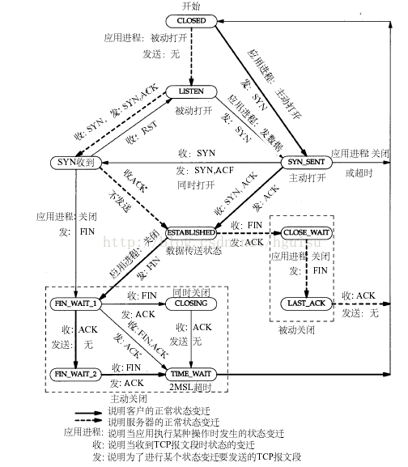
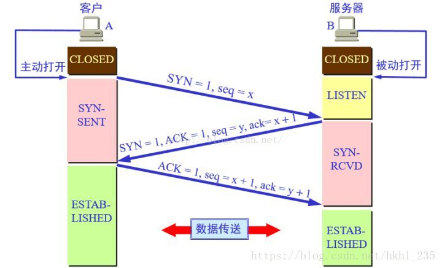
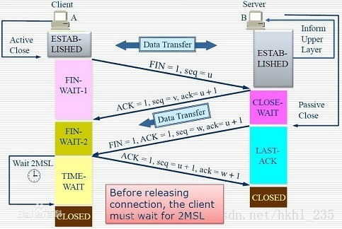

## 几个命令
linux查看tcp的状态命令：
1. netstat -nat  查看TCP各个状态的数量
2. lsof  -i:port  可以检测到打开套接字的状况
3. sar -n SOCK 查看tcp创建的连接数
4. tcpdump -iany tcp port 9000 对tcp端口为9000的进行抓包

## 网络测试常用命令
1. ping:检测网络连接的正常与否,主要是测试延时、抖动、丢包率。
   但是很多服务器为了防止攻击，一般会关闭对ping的响应。所以ping一般作为测试连通性使用。ping命令后，会接收到对方发送的回馈信息，其中记录着对方的IP地址和TTL。TTL是该字段指定IP包被路由器丢弃之前允许通过的最大网段数量。TTL是IPv4包头的一个8 bit字段。例如IP包在服务器中发送前设置的TTL是64，你使用ping命令后，得到服务器反馈的信息，其中的TTL为56，说明途中一共经过了8道路由器的转发，每经过一个路由，TTL减1。

2. traceroute：raceroute 跟踪数据包到达网络主机所经过的路由工具
   traceroute hostname
3. pathping：是一个路由跟踪工具，它将 ping 和 tracert 命令的功能与这两个工具所不提供的其他信息结合起来，综合了二者的功能
   pathping www.baidu.com
4. mtr：以结合ping nslookup tracert 来判断网络的相关特性
5. nslookup:用于解析域名，一般用来检测本机的DNS设置是否配置正确。

## 两次握手可以么
TCP连接时是三次握手，那么两次握手可行吗？

在谢希仁著《计算机网络》第六版中讲"三次握手"的目的是"为了防止已失效的连接请求报文段突然又传送到了服务端，因而产生错误"。

假定出现一种异常情况下：client发出的第一个连接请求报文段并没有丢失，而是在某个网络结点长时间的滞留了，以致延误到连接释放以后的某个时间才到达server。本来这是一个早已失效的报文段。但server收到此失效的连接请求报文段后，就误认为是client再次发出的一个新的连接请求。于是就向client发出确认报文段，同意建立连接。假设不采用“三次握手”，那么只要server发出确认，新的连接就建立了。由于现在client并没有发出建立连接的请求，因此不会理睬server的确认，也不会向server发送ACK包。这样就会白白浪费资源。

而经过三次握手，客户端和服务器都有应有答，这样可以确保TCP正确连接。

### 为什么TCP连接是三次，挥手确是四次
在TCP连接中，服务器端的SYN和ACK向客户端发送是一次性发送的，而在断开连接的过程中，B端向A端发送的ACK和FIN是是分两次发送的。  
因为在B端接收到A端的FIN后，B端可能还有数据要传输，所以先发送ACK，等B端处理完自己的事情后就可以发送FIN断开连接了。

## 状态机
* LISTEN：侦听来自远方的TCP端口的连接请求
* SYN-SENT：再发送连接请求后等待匹配的连接请求（客户端）
* SYN-RECEIVED：再收到和发送一个连接请求后等待对方对连接请求的确认（服务器）
* ESTABLISHED：代表一个打开的连接
* FIN-WAIT-1：等待远程TCP连接中断请求，或先前的连接中断请求的确认
* FIN-WAIT-2：从远程TCP等待连接中断请求
* CLOSE-WAIT：等待从本地用户发来的连接中断请求
* CLOSING：等待远程TCP对连接中断的确认
* LAST-ACK：等待原来的发向远程TCP的连接中断请求的确认
* TIME-WAIT：等待足够的时间以确保远程TCP接收到连接中断请求的确认
* CLOSED：没有任何连接状态

客户端的状图迁移图 CLOSED -- 发送SYN请求报文--> SYN_SENT -- 接收SYNACK&发送ACK --> ESTABLISHED -- 发送FIN请求报文 --> FIN_WAIT1 -- 接收ACK --> FIN_WAIT2 -- 接收FIN报文&发送ACK --> TIME_WAIT -- 等待2MSL --> CLOSED

服务器的状态迁移图 CLOSED -- 创建套接字，监听 --> LISTEN -- 接收SYN请求&回复SYNACK --> SYN_RCVD -- 收到ACK --> ESTABLISHED -- 接收FIN&发送ACK --> CLOSE_WAIT -- 发送FIN --> LAST_ACK -- 接收ACK --> CLOSED

### LISTENING 侦听来自远方的TCP端口的连接请求
  首先服务端需要打开一个socket进行监听，状态为LISTEN。
  有提供某种服务才会处于LISTENING状态，TCP状态变化就是某个端口的状态变化，提供一个服务就打开一个端口，例如：提供www服务默认开的是80端口，提供ftp服务默认的端口为21，当提供的服务没有被连接时就处于LISTENING状态。FTP服务启动后首先处于侦听（LISTENING）状态。处于侦听LISTENING状态时，该端口是开放的，等待连接，但还没有被连接。就像你房子的门已经敞开的，但还没有人进来。
  看LISTENING状态最主要的是看本机开了哪些端口，这些端口都是哪个程序开的，关闭不必要的端口是保证安全的一个非常重要的方面，服务端口都对应一个服务（应用程序），停止该服务就关闭了该端口，例如要关闭21端口只要停止IIS服务中的FTP服务即可。关于这方面的知识请参阅其它文章。
  如果你不幸中了服务端口的木马，木马也开个端口处于LISTENING状态。

### SYN-SENT：客户端SYN_SENT状态：
  在发送连接请求后等待匹配的连接请求:客户端通过应用程序调用connect进行active open.于是客户端tcp发送一个SYN以请求建立一个连接.之后状态置为SYN_SENT. /*The socket is actively attempting to establish a connection*/. 在发送连接请求后等待匹配的连接请求 
  当请求连接时客户端首先要发送同步信号给要访问的机器，此时状态为SYN_SENT，如果连接成功了就变为ESTABLISHED，正常情况下SYN_SENT状态非常短暂。例如要访问网站:http://www.baidu.com, 如果是正常连接的话，用TCPView观察IEXPLORE.EXE（IE）建立的连接会发现很快从SYN_SENT变为ESTABLISHED，表示连接成功。SYN_SENT状态快的也许看不到。
  如果发现有很多SYN_SENT出现，那一般有这么几种情况，一是你要访问的网站不存在或线路不好，二是用扫描软件扫描一个网段的机器，也会出出现很多SYN_SENT，另外就是可能中了病毒了，例如中了"冲击波"，病毒发作时会扫描其它机器，这样会有很多SYN_SENT出现。

### SYN-RECEIVED：服务器端状态SYN_RCVD
   在收到和发送一个连接请求后等待对方对连接请求的确认
   当服务器收到客户端发送的同步信号时，将标志位ACK和SYN置1发送给客户端，此时服务器端处于SYN_RCVD状态，如果连接成功了就变为ESTABLISHED，正常情况下    SYN_RCVD状态非常短暂。
   如果发现有很多SYN_RCVD状态，那你的机器有可能被SYN Flood的DoS(拒绝服务攻击)攻击了。
   SYN Flood的攻击原理是：
   在进行三次握手时，攻击软件向被攻击的服务器发送SYN连接请求（握手的第一步），但是这个地址是伪造的，如攻击软件随机伪造了51.133.163.104、65.158.99.152等等地址。服务器在收到连接请求时将标志位ACK和SYN置1发送给客户端（握手的第二步），但是这些客户端的IP地址都是伪造的，服务器根本找不到客户机，也就是说握手的第三步不可能完成。
    这种情况下服务器端一般会重试（再次发送SYN+ACK给客户端）并等待一段时间后丢弃这个未完成的连接，这段时间的长度我们称为SYN Timeout，一般来说这个时间是分钟的数量级（大约为30秒-2分钟）；一个用户出现异常导致服务器的一个线程等待1分钟并不是什么很大的问题，但如果有一个恶意的攻击者大量模拟这种情况，服务器端将为了维护一个非常大的半连接列表而消耗非常多的资源----数以万计的半连接，即使是简单的保存并遍历也会消耗非常多的CPU时间和内存，何况还要不断对这个列表中的IP进行SYN+ACK的重试。此时从正常客户的角度看来，服务器失去响应，这种情况我们称做：服务器端受到了SYN Flood攻击（SYN洪水攻击）

### ESTABLISHED：代表一个打开的连接。
  ESTABLISHED状态是表示两台机器正在传输数据，观察这个状态最主要的就是看哪个程序正在处于ESTABLISHED状态。
  服务器出现很多ESTABLISHED状态： netstat -nat |grep 9502或者使用lsof  -i:9502可以检测到。
  当客户端未主动close的时候就断开连接：即客户端发送的FIN丢失或未发送。
  这时候若客户端断开的时候发送了FIN包，则服务端将会处于CLOSE_WAIT状态；
  这时候若客户端断开的时候未发送FIN包，则服务端处还是显示ESTABLISHED状态；
  结果客户端重新连接服务器。
  而新连接上来的客户端（也就是刚才断掉的重新连上来了）在服务端肯定是ESTABLISHED; 如果客户端重复的上演这种情况，那么服务端将会出现大量的假的ESTABLISHED连接和CLOSE_WAIT连接。
  最终结果就是新的其他客户端无法连接上来，但是利用netstat还是能看到一条连接已经建立，并显示ESTABLISHED，但始终无法进入程序代码。

### FIN-WAIT-1：等待远程TCP连接中断请求，或先前的连接中断请求的确认
  主动关闭(active close)端应用程序调用close，于是其TCP发出FIN请求主动关闭连接，之后进入FIN_WAIT1状态./* The socket is closed, and the connection is shutting down*/. 等待远程TCP的连接中断请求，或先前的连接中断请求的确认 
  如果服务器出现shutdown再重启，使用netstat -nat查看，就会看到很多FIN-WAIT-1的状态。就是因为服务器当前有很多客户端连接，直接关闭服务器后，无法接收到客户端的ACK。

### FIN-WAIT-2：从远程TCP等待连接中断请求
   主动关闭端接到ACK后，就进入了FIN-WAIT-2 ./* Connection is closed, and the socket is waiting for a shutdown from the remote end*/. 从远程TCP等待连接中断请求 
   这就是著名的半关闭的状态了，这是在关闭连接时，客户端和服务器两次握手之后的状态。在这个状态下，应用程序还有接受数据的能力，但是已经无法发送数据，但是也有一种可能是，客户端一直处于FIN_WAIT_2状态，而服务器则一直处于WAIT_CLOSE状态，而直到应用层来决定关闭这个状态。

### CLOSE-WAIT：等待从本地用户发来的连接中断请求
   被动关闭(passive close)端TCP接到FIN后，就发出ACK以回应FIN请求(它的接收也作为文件结束符传递给上层应用程序),并进入CLOSE_WAIT. /* The remote end has shut down, waiting for the socket to close*/. 等待从本地用户发来的连接中断请求 
       
### CLOSING：等待远程TCP对连接中断的确认
比较少见./* Both sockets are shut down but we still don't have all our data sent*/. 等待远程TCP对连接中断的确认 

### LAST-ACK：等待原来的发向远程TCP的连接中断请求的确认
被动关闭端一段时间后，接收到文件结束符的应用程序将调用CLOSE关闭连接。这导致它的TCP也发送一个 FIN,等待对方的ACK.就进入了LAST-ACK . /* The remote end has shut down, and the socket is closed. Waiting for acknowledgement*/. 等待原来发向远程TCP的连接中断请求的确认 
使用并发压力测试的时候，突然断开压力测试客户端，服务器会看到很多LAST-ACK。

### TIME-WAIT：等待足够的时间以确保远程TCP接收到连接中断请求的确认
在主动关闭端接收到FIN后，TCP就发送ACK包，并进入TIME-WAIT状态。/* The socket is waiting after close to handle packets still in the network*/.等待足够的时间以确保远程TCP接收到连接中断请求的确认 TIME_WAIT等待状态，这个状态又叫做2MSL状态，说的是在TIME_WAIT2发送了最后一个ACK数据报以后，要进入TIME_WAIT状态。这个状态是防止最后一次握手的数据报没有传送到对方那里而准备的（注意这不是四次握手，这是第四次握手的保险状态）。这个状态在很大程度上保证了双方都可以正常结束。    

1. 为实现TCP全双工连接的可靠释放

由TCP状态变迁图可知，假设发起主动关闭的一方（client）最后发送的ACK在网络中丢失，由于TCP协议的重传机制，执行被动关闭的一方（server）将会重发其FIN，在该FIN到达client之前，client必须维护这条连接状态，也就说这条TCP连接所对应的资源（client方的local_ip,local_port）不能被立即释放或重新分配，直到另一方重发的FIN达到之后，client重发ACK后，经过2MSL时间周期没有再收到另一方的FIN之后，该TCP连接才能恢复初始的CLOSED状态。如果主动关闭一方不维护这样一个TIME_WAIT状态，那么当被动关闭一方重发的FIN到达时，主动关闭一方的TCP传输层会用RST包响应对方，这会被对方认为是有错误发生，然而这事实上只是正常的关闭连接过程，并非异常。

2. 为使旧的数据包在网络因过期而消失

为说明这个问题，我们先假设TCP协议中不存在TIME_WAIT状态的限制，再假设当前有一条TCP连接：(local_ip, local_port, remote_ip,remote_port)，因某些原因，我们先关闭，接着很快以相同的四元组建立一条新连接。本文前面介绍过，TCP连接由四元组唯一标识，因此，在我们假设的情况中，TCP协议栈是无法区分前后两条TCP连接的不同的，在它看来，这根本就是同一条连接，中间先释放再建立的过程对其来说是“感知”不到的。这样就可能发生这样的情况：前一条TCP连接由local peer发送的数据到达remote peer后，会被该remot peer的TCP传输层当做当前TCP连接的正常数据接收并向上传递至应用层（而事实上，在我们假设的场景下，这些旧数据到达remote peer前，旧连接已断开且一条由相同四元组构成的新TCP连接已建立，因此，这些旧数据是不应该被向上传递至应用层的），从而引起数据错乱进而导致各种无法预知的诡异现象。作为一种可靠的传输协议，TCP必须在协议层面考虑并避免这种情况的发生，这正是TIME_WAIT状态存在的第2个原因。

当服务器先关闭连接,如果不在一定时间内维护一个这样的TIME_WAIT状态,那么当被动关闭的一方的FIN到达时，服务器的TCP传输层会用RST包响应对方，这样被对方认为是有错误发生，事实上这只是正常的关闭连接工程，并没有异常

如果服务器端确实存在大量的TIME_WAIT，那么会导致什么问题呢，被占用的是一个五元组(协议,本地IP,本地端口,远程IP,远程端口)
对于Web服务器，协议是TCP,本地ip也只有一个,端口一般是80或者433或8080(固定的)，只剩下远程IP和远程端口可用了,如果远程IP相同的话，就只有远程端口可用了，远程端口只有几万个,所以当同一客户端向服务器建立了大量连接的话，可用的五元组会耗尽导致问题

但是，问题也来了：由于套接字的2MSL状态（套接字是IP和端口对的意思，socket），使得应用程序在2MSL时间内是无法再次使用同一个套接字的，对于客户程序还好一些，但是对于服务程序，例如httpd，它总是要使用同一个端口来进行服务，而在2MSL时间内，启动httpd就会出现错误（套接字被使用）。为了避免这个错误，服务器给出了一个平静时间的概念，这是说在2MSL时间内，虽然可以重新启动服务器，但是这个服务器还是要平静的等待2MSL时间的过去才能进行下一次连接。
 详情请看：TIME_WAIT引起Cannot assign requested address报错

### CLOSED：没有任何连接状态
被动关闭端在接受到ACK包后，就进入了closed的状态。连接结束./* The socket is not being used*/. 没有任何连接状态 
